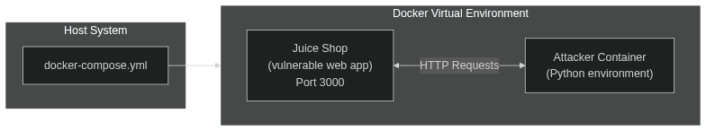

# **[F25] Group Project Assignment:** Exploiting Vulnerable Web Application with the Help of the Analysis Tools

**Link to the GitHub** — https://github.com/sunflye/Juice-Shop-Analysis 

## Goal

Statically analyse vulnerable Juice Shop web application with semgrep tool. Deploy the environment and exploit some found vulnerabilities, suggest possible fixes.

## Team (Group: CSE-01):
1. Polina Kostikova (p.kostikova@innopolis.university) — do environment preparation and create exploites
2. Sofia Palkina (s.palkina@innopolis.university) — write this report and suggest fixes
3. Amir Bairamov (a.bairamov@innopolis.university) — write this report and do environment preparation 

## Attack surface and scenarios description

[OWASP Juice Shop](https://owasp.org/www-project-juice-shop/) is probably the most modern and sophisticated insecure web application. It encompasses vulnerabilities from the entire OWASP Top Ten along with many other security flaws found in real-world applications.

**Scenario:**
- **Launch** the `Juice Shop`.
- **Learn** as much as possible about it's vulnerabilities by using `semgrep`.
- **Exploit** 3 vulnerabilities, using the provided example payloads.
- **Suggest** possible fixes

**Schema:**



## Vulnerabilities description

1. **SQL Injection (CWE-89):**

    - **Description**: The product constructs all or part of an SQL command using externally-influenced input from an upstream component, but it does not neutralize or incorrectly neutralizes special elements that could modify the intended SQL command when it is sent to a downstream component. Without sufficient removal or quoting of SQL syntax in user-controllable inputs, the generated SQL query can cause those inputs to be interpreted as SQL instead of ordinary user data.

    - **[CVSSv3 score](https://www.first.org/cvss/calculator/3-0)**: 9.8 (CVSS:3.0/AV:N/AC:L/PR:N/UI:N/S:U/C:H/I:H/A:H)

    - **Reference**: https://cwe.mitre.org/data/definitions/89.html 

2. **Path Traversal (CWE-73):**

    - **Description**: The product allows user input to control or influence paths or file names that are used in filesystem operations.

    - **[CVSSv3 score](https://www.first.org/cvss/calculator/3-0)**: 7.5 (CVSS:3.0/AV:N/AC:L/PR:N/UI:N/S:U/C:H/I:N/A:N)

    - **Reference**: https://cwe.mitre.org/data/definitions/73.html 

3. **Insecure Direct Object Reference (IDOR) (CWE-639):**

    - **Description**: The system's authorization functionality does not prevent one user from gaining access to another user's data or record by modifying the key value identifying the data.

    - **[CVSSv3 score](https://www.first.org/cvss/calculator/3-0)**: 5.0 (CVSS:3.0/AV:N/AC:L/PR:L/UI:N/S:C/C:L/I:N/A:N)

    - **Reference**: https://cwe.mitre.org/data/definitions/639.html 

## Environment preparation

- Ensure you have docker and docker compose plugin installed.
```
docker -v
docker compose version
```

- Clone this repository.
```
git clone https://github.com/sunflye/Juice-Shop-Analysis.git
```

- Change into the project directory.
```
cd Juice-Shop-Analysis
```

- Launch the `attack-network` and wait for the containers to be ready.
```
docker-compose up -d

# Or in some cases:
# docker compose up -d
```

## Exploits steps

- First, find the most important vulnerabilities in the `Juice Shop` source code. Run the `semgrep` tool on it.
```
???
```

On this step you can choose any of the found vulnerabilities. We will continue the attack only with 3 of them: CWE-89, CWE-73, CWE-639.

- Exploit **SQL Injection** (`CWE-89`).
```
docker compose run attacker python exploit_sqli.py
```

- Exploit **Path Traversal** (`CWE-73`).
```
docker compose run attacker python exploit_path_traversal.py
```

- Before exploit IDOR you should create a new user. To do that go to http://localhost:3000 and use the following credentials:
    - email — `user@juice-sh.op`
    - password — `user123`

- Exploit **IDOR** (`CWE-639`).
```
docker compose run attacker python exploit_idor_basket.py
```

## Defense mechanisms

Below are the defense mechanisms for three SWEs for which we have written exploits: CWE-89, CWE-73, CWE-639. The recommendations are based on the exploit results we obtained.

###  Defense mechanisms for CWE-89 (SQL Injection)

1. **Eliminate Raw SQL with Unsafe String Concatenation:** 

    The exploit suggests the backend might be constructing queries by directly embedding the q parameter into a SQL string (e.g., ``"SELECT * FROM products WHERE name LIKE '%" + userInput + "%'"``). This must be replaced with parameterized queries (prepared statements). For Juice Shop's Sequelize ORM, this means using the replacement syntax or query builders that separate data from instructions.

2. **Implement Strict Input Validation for the Search Parameter:**

    Define and enforce a strict whitelist pattern for the q parameter. Allow only alphanumeric characters, spaces, and a limited set of safe symbols (e.g., hyphens, apostrophes for product names like O'Juice). Reject any input containing SQL metacharacters like ``'``, ``"``, ``;``, ``--``, ``#``, ``/*``, ``*/``, ``OR``, ``UNION``, ``SELECT`` outside of a safe context.

3. **Configure Database User with Least Privilege:**

    The application's database user should have the minimum necessary privileges—likely only ``SELECT`` on the Products table. This would render destructive payloads like ``'; DROP TABLE products; --`` ineffective, even if injection occurs, as the user would lack ``DROP`` permission.

4. **Implement Robust Error Handling:**

    Configure the application to return generic, user-friendly error messages (e.g., A search error occurred). The exploit shows detailed SQL errors (``SQLITE_ERROR: near "UNION": syntax error``), which aid attackers. Log the detailed errors internally for debugging instead

###  Defense mechanisms for CWE-73 (Path Traversal)

1. **Whitelist Allowed Filenames:** 

    Do not accept user input (file parameter) as a path. Instead, maintain a whitelist of safe, known files (e.g., ``"legal.md", "acquisitions.md"``). Map the user's request to this list.

2. **Use a Built-in Safeguard:** 

    If you must accept a filename, use a basename function (like Node.js's ``path.basename()``) to strip any directory components (``../``, ``/etc/``) before processing. This neutralizes traversal sequences.

3. **Validate Against a Regex Pattern:**

    Reject any file parameter containing path traversal characters (``..``,`` /``, ``\``) or sequences like ``%2e%2e%2f`` (URL-encoded ``../``).

4. **Apply the Principle of Least Privilege to the Server Process:**

    The Node.js process running Juice Shop should have read-only permissions strictly for the directories it needs to serve files from (e.g., ``./ftp/``). It should have no read access to source directories (``./config/``, ``./.env``) and no execute permissions anywhere unnecessary.

###  Defense mechanisms for CWE-639 (IDOR)

1. **Enforce Ownership Verification:** 

    For every API request to access a BasketItem, the backend must validate that the requested resource belongs to the currently authenticated user (extracted from the JWT token). This check must happen on the server, before any data is fetched from the database.

2. **Query Design:**

    Modify database queries to include the user's identity as a mandatory filter. Example: Instead of ``SELECT * FROM BasketItems WHERE id = ?``, use ``SELECT * FROM BasketItems WHERE id = ? AND userId = ?`` (where ``userId`` is taken from the JWT session).

3. **Replace Direct Database IDs:**

    Instead of exposing predictable, sequential database IDs (1, 2, 3...) in API parameters, use random, non-guessable identifiers (UUIDs) or encrypted/obfuscated tokens. This makes large-scale IDOR enumeration significantly harder, though it is not a substitute for server-side checks (1-2 mechanisms).


## Difficulties faced, new skills

...

Throughout the project, we gained practical experience in several key areas of cybersecurity. We learned how to **use Semgrep effectively** for static code analysis. Writing and executing exploit scripts deepened our knowledge of vulnerability exploitation techniques, including **attack automation**. Additionally, we developed the ability to analyze exploit outcomes and translate them into actionable security recommendations.

## Conclusion

This project provided a hands-on exploration of web application security by analyzing and exploiting vulnerabilities in the OWASP Juice Shop. Using Semgrep for static analysis, we identified critical weaknesses such as SQL injection, path traversal, and insecure direct object references. By deploying a controlled environment and executing targeted exploits, we demonstrated how these vulnerabilities could be leveraged in real-world scenarios. The suggested defense mechanisms highlight the importance of proactive security practices in software development. 
